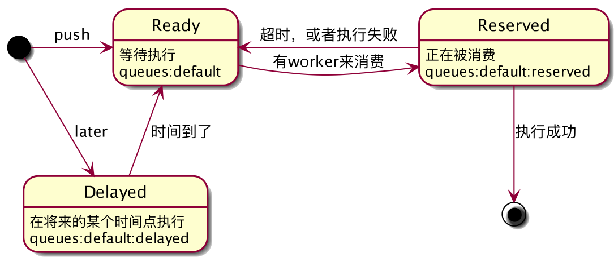

<!-- $size: 16:9 -->
# Laravel 的 Queue 是如何工作的

* Queue::push
* worker
* Dispatch
* 建议
* 问题

---

# 队列是如何运行的



---

# `Illuminate\Contracts\Queue\Queue`

```php
Queue::push($job, $data = '')
```

* job是一个Job对象（`is_object`）
```php
[
  'job' => 'Illuminate\Queue\CallQueuedHandler@call',
  'data' => ['command' => serialize(clone $job)],
]
```

---

* job是一个string
```php
[
  'job' => $job,
  'data' => $this->prepareQueueableEntities($data)
]
```
值得注意的是，如果`$data`是Model，或者是array中嵌套了Model，则会只记录id

* job是一个Closure
```php
[
  'job' => 'IlluminateQueueClosure',
  'data' => compact('closure')
]
```
data是加密的

---

# Worker

## 取出任务

1. `migrateAllExpiredJobs($queue)`
   * `migrateExpiredJobs($queue.':delayed', $queue)`
     从delayed的zset中取出过期的任务，放到ready队列中
   * `migrateExpiredJobs($queue.':reserved', $queue)`
     从reserved的zset中取出应该执行的任务，放到ready队列中
2. lpop
3. `zadd($queue.':reserved', getTime() + $expire, $job)`

<hr/>

`queues:<qname>:delayed`和`queues:<qname>:reserved`都是zset，里面放的都是job的数据。score是需要处理（执行或者过期）的时间戳。

---

# Worker

## 执行

1. 解析出job
2. 解析依赖（注入）
3. `resolveQueueableEntities`
4. 执行

---

# Worker

`Illuminate\Queue\CallQueuedHandler::call`的三个参数
1. $job job对象序列化后的结果
2. 执行
3. `isDeletedOrReleased || delete`

<hr/>

* 如果失败，可以调用Job的`failed`方法

* CallQueuedHandler帮我们做了很多事情（自动删除、failed方法）
---

现在的官方文档中，唯一推荐的方式就是：

```php
use \Illuminate\Foundation\Bus\DispatchesJobs;

$this->dispatch($job);
```

---

# 建议

如果需要用队列（推荐程度递减）

1. dispatch是最好的选择，5.1的社区推荐版（它是未来）
2. Queue::push一个object，5.0式的用法（无伤大雅）
3. Queue::push一个闭包，尽量不要使用
4. Queue::push一个string，4.2式的写法（强烈不建议）

---

# 上线时队列如何重启？

上线新代码，旧的worker需要重启，但是可能有job正在执行。

**此时如何重启worker？**